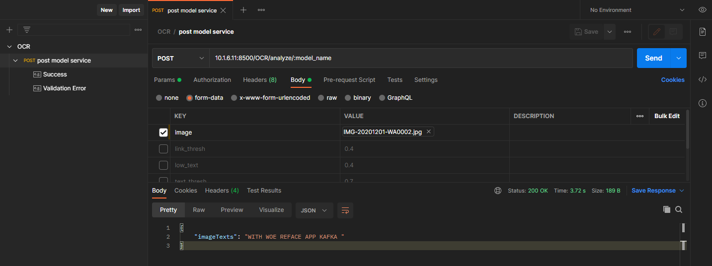
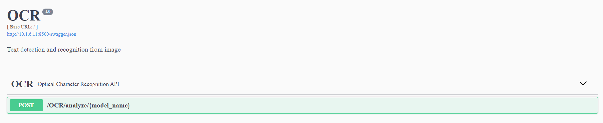

# Two-Stage Flask OCR
This is asimple python optical character recognition server. It's model consists of two parts - detection([CRAFT](https://gitee.com/tianyu__zhou/pyacl_samples/tree/a800/acl_craft_pt)) and recognition([deep-text-regonition](https://gitee.com/tianyu__zhou/pyacl_samples/tree/a800/acl_deep_text_recognition_pt))

**Warning!** This is a commercial application by Huawei Turkey (Copyright 2021)





## Getting started
Install dependencies;
- numpy
- Pillow
- opencv-python-headless
- scikit-image
- werkzeug
- flask-restplus == 0.12.1
- flask == 1.0.3
- pyarmor
- cryptography

```
pip install -r requirements.txt
```

### Run Server
Open the terminal on the project path and then run the following command.

```bash
python3 app.py
```

**Note :** Import `OCR_REST-API.postman_collection.json` file to `postman` collections for easy demo

## Swagger Usage
Swagger will be available `http://{server_ip}:{server_port}`

Please, look at the wiki page for swagger usage details 

## Docker Build & Run
First of all, download [Ascend-cann-nnrt_5.0.2_linux-x86_64.run](https://support.huawei.com/enterprise/zh/software/252806303-ESW2000387054) inference engine software package from [hiascend](www.hiascend.com/en/) website to project path and then build the docker image by running the following code on bash.

```bash
sudo docker build -t pyacl_ocr_api:1.0 \
                --build-arg NNRT_PKG=Ascend-cann-nnrt_5.0.2_linux-x86_64.run .
```

Finally, you can run the docker image with the following code on bash.

```bash
sudo docker_run.sh 8500 8500 pyacl_ocr_api:1.0
```

## File Encryption
Please, use [utils/file_encryption.py](./utils/file_encryption.py) script to encrypt files like `*.om` and `*.cfg` files as follows

```bash
python3 file_encryption.py --model <file_name>
```

And then put the generated code in the `app.py` script.

## Code Obfuscation & Licensing
First, creat an expired license and then obfuscate the code with that license as like below

```bash
$ pyarmor licenses --expired YYYY-MM-DD r001
$ pyarmor obfuscate --with-license licenses/r001/license.lic --recursive --advanced 2 app.py
```